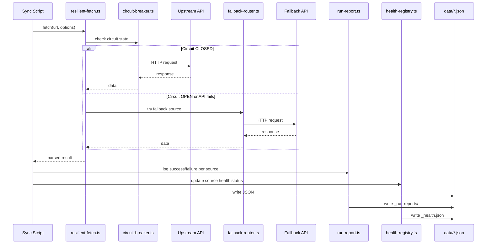
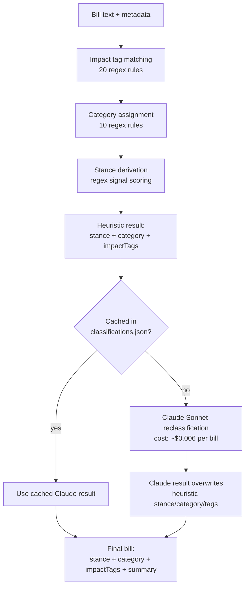
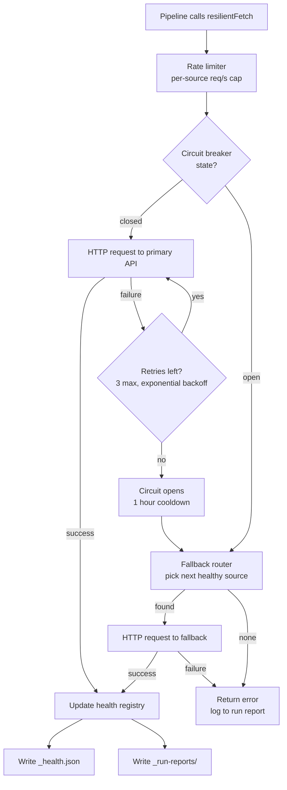

# Architecture

Housing Crisis Tracker is a Next.js 16 application that ingests housing policy data from government APIs, classifies legislation by stance, and renders it on interactive maps. This document covers the system design, data flow, and technical decisions.

[Back to README](README.md)

## System Overview

```mermaid
graph TD
    subgraph Primary_Pipelines["Canadian Pipelines"]
        LEGI[LEGISinfo JSON] --> LEGSYNC[canada-legislation.ts]
        OP[OpenParliament fallback] --> LEGSYNC
        BCLAWS[BC Laws API] --> BCSYNC[bc-legislation.ts]
        CANLII[CanLII via Tavily fallback] --> BCSYNC
        TAV1[Tavily research] --> PROVSYNC[province-housing-research.ts]
        BCH[Build Canada Homes via Tavily] --> PROJSYNC[housing-projects.ts]
        HICC[HICC CSV export] --> NHSSYNC[cmhc-nhs-projects.ts]
        STATCSV[StatsCan CSV download] --> CMHCSYNC[cmhc-projects.ts]
        CANADACA[canada.ca cabinet] --> OFFSYNC[officials.ts]
        TAV2[Tavily enrichment] --> OFFSYNC
        RSS[Canadian housing RSS feeds] --> NEWS[news-rss.ts]
        STATCAN[StatsCan WDS] --> METR[metrics-sync.ts]
        CMHC[CMHC HMI portal] --> METR
        CENSDATA[Census division boundaries] --> MUNSYNC[canada-municipal-housing.ts]
    end

    subgraph Enrichment["Enrichment Pipeline"]
        TAVILY_E[Tavily search + extract] --> ENRICH[enrich-project-descriptions.ts]
        HAIKU[Claude Haiku summarization] --> ENRICH
    end

    LEGSYNC --> FEDJSON[data/legislation/federal-ca.json]
    BCSYNC --> BCJSON[data/legislation/provinces/BC.json]
    PROVSYNC --> PROVJSON[data/legislation/provinces/*.json]
    PROJSYNC --> PROJJSON[data/projects/canada.json]
    NHSSYNC --> PROJJSON
    CMHCSYNC --> PROJJSON
    MUNSYNC --> MUNJSON[data/municipal/canada/*.json]
    OFFSYNC --> POLSJSON[data/politicians/canada.json]
    NEWS --> NEWSJSON[data/news/summaries.json]
    METR --> METRJSON[data/housing/canada/*.json]
    ENRICH --> PROJJSON

    subgraph Resilience["Resilience Layer"]
        RF[resilient-fetch.ts]
        FR[fallback-router.ts]
        RR[run-report.ts]
        HR[health-registry.ts]
    end

    LEGSYNC --> RF
    BCSYNC --> RF
    PROVSYNC --> RF
    PROJSYNC --> RF
    OFFSYNC --> RF
    RF --> RR
    RF --> HR
    RR --> RUNLOG[data/raw/_run-reports/]
    HR --> HEALTHJSON[data/raw/_health.json]

    subgraph Build["Build"]
        BLD[build-placeholder.ts] --> PLH[lib/placeholder-data.ts]
    end

    FEDJSON --> BLD
    BCJSON --> BLD
    PROVJSON --> BLD
    PROJJSON --> BLD
    POLSJSON --> BLD
    NEWSJSON --> BLD
    METRJSON --> BLD

    subgraph UI["Next.js 16 App"]
        HEALTH["api/health"]
        FOOTER["HealthFooter"]
        DS["about/data-sources"]
        FUNNEL["LegislativeFunnel"]
        CENSUS["CensusDivisionMap"]
        DIM["DimensionToggle"]
    end

    HEALTHJSON --> HEALTH
    HEALTH --> FOOTER
    FOOTER --> DS

    subgraph Cron["GitHub Actions"]
        W1[news-rss.yml 3x daily]
        W2[legislation-sync.yml weekly Wed]
        W3[metrics-sync.yml weekly Mon]
        W4[projects-sync.yml weekly Tue]
        W5[officials-sync.yml monthly 1st Sun]
        W6[europe-asia-sync.yml manual dispatch only]
    end

    subgraph US_Pipelines["US Pipelines"]
        CGOV[Congress.gov API primary] --> USFEDSYNC[us-federal-housing.ts]
        TAVILYF[Tavily enrichment cap] --> USFEDSYNC
        USST[state legislature domains via Tavily] --> USSTSYNC[us-states-housing-research.ts]
        APIFY[Apify state scrapers] --> USSTSYNC
        LEGISCAN[LegiScan dormant supplement] --> USLSSYNC[us-legiscan-housing.ts]
        USPROJ[HUD + state agencies via Tavily] --> USPROJSYNC[us-housing-projects.ts]
        HUDGOV[hud.gov leadership] --> USOFFSYNC[us-officials.ts]
    end

    USFEDSYNC --> USFEDJSON[data/legislation/federal-us-housing.json]
    USSTSYNC --> USSTJSON[data/legislation/us-states-housing/*.json]
    USLSSYNC --> USSTJSON
    USPROJSYNC --> USPROJJSON[data/projects/us.json]
    USOFFSYNC --> USOFFJSON[data/politicians/us.json]

    USFEDJSON --> BLD
    USSTJSON --> BLD
    USPROJJSON --> BLD
    USOFFJSON --> BLD

    subgraph IntlPipelines["Europe + Asia-Pacific, manual dispatch"]
        EUSYNC[europe-housing.ts, 11 countries]
        EUOFF[europe-officials.ts]
        APSYNC[asia-pacific-housing.ts, 7 countries]
        APOFF[asia-officials.ts]
    end
    EUSYNC --> W6
    EUOFF --> W6
    APSYNC --> W6
    APOFF --> W6
```



## Data Pipeline Flow

What happens when a sync script runs, whether triggered by GitHub Actions or invoked manually.



## Classification Pipeline

Bills go through two stages. The heuristic pass runs on every sync. Claude reclassification is optional, triggered manually, and cached incrementally.



**Heuristic stage** (`scripts/sync/legislation-classify.ts`, 679 lines):
- 20 regex-based impact tag rules: affordability, density, displacement, lot-splitting, inclusionary-zoning, transit-oriented, public-land, rent-stabilization, homelessness, social-housing, indigenous-housing, foreign-buyer, first-time-buyer, vacancy-tax, short-term-rental, mortgage-regulation, community-opposition, heritage-protection, environmental-review, nimby.
- 10 category rules: zoning-reform, rent-regulation, affordable-housing, development-incentive, building-code, foreign-investment, homelessness-services, tenant-protection, transit-housing, property-tax.
- Stance derived from signal scoring. Favorable signals include supply-increase keywords (upzoning, density bonus, ADU, fast-track). Restrictive signals include moratorium, downzoning, height limits, protection repeal. Bills that match neither default to "review."

**Claude stage** (`scripts/sync/legislation-reclassify.ts`, 257 lines):
- Model: `claude-sonnet-4-6`
- Incremental cache at `data/raw/claude/classifications.json` keyed by bill ID
- Env var `RECLASSIFY_MAX` caps API calls per run
- Prompt caching via Anthropic `cache_control` on the system prompt
- Full run cost for ~608 bills: roughly $3.60

**Stance definitions:**

| Stance | Meaning |
|--------|---------|
| favorable | Increases supply (upzoning, density, ADU), funds affordable housing, protects tenants |
| restrictive | Reduces density, removes protections, cuts funding, exclusionary zoning |
| concerning | Mixed provisions, good intent but risky implementation, tangential housing mentions |
| review | Text unavailable, purely procedural, or appropriations without housing content |

Current Canadian breakdown (415 bills): 76% review, 13% favorable, 8% concerning, 3% restrictive.

## Project Structure

```
app/                     Next.js 16 app router pages and API routes
  about/                 About page and data-sources sub-page
  api/health/            Health check endpoint
  bills/                 Legislation browser
  contact/               Contact form
  globe/                 3D globe view
  legislation/[id]/      Individual bill detail
  methodology/           Classification methodology
  news/                  News feed and article detail
  politicians/           Officials grid
  projects/              Project list and detail

components/
  hero/                  GlobeHero, Hero
  map/                   CanadaProvincesMap, USStatesMap, EuropeMap, AsiaMap,
                         NorthAmericaMap, CensusDivisionMap, CountyMap, MapShell,
                         ProjectDots, ProjectCard, MobileLegend
  panel/                 SidePanel, LegislationList, BillExpanded, ContextBlurb,
                         KeyFigures, NewsSection, ProjectsList, ProjectDetail,
                         HousingMetricsSection
  sections/              SummaryBar, LegislationTable, LiveNews, AIOverview,
                         PoliticiansOverview, ProjectsOverview, NuanceLegend,
                         DimensionToggle, LegislativeFunnel, ProjectCard
  ui/                    Header, HealthFooter, TopToolbar, SearchPill, Card,
                         StanceBadge, StagePill, BillTimeline, Breadcrumb,
                         VisitorsWidget

lib/
  resilience/            circuit-breaker, fallback-router, health-registry,
                         rate-limit, run-report
  schemas/               housing-project schema
  sources/               apify, congress-gov, legiscan, openparliament
  placeholder-data.ts    Generated file that feeds the UI at build time
  resilient-fetch.ts     Fetch wrapper with retry + circuit breaker
  tavily-*.ts            Tavily client, cache, budget, types
  search.ts              Client-side search across bills/projects/politicians

scripts/
  build-placeholder.ts   Reads all JSON data and writes placeholder-data.ts
  ci/                    summarize-run-report (GitHub Actions step summary)
  cleanup/               fill-impact-tags, refresh-blurbs, rewrite-blurbs
  geo/                   fetch-canada-geo (census boundary GeoJSON)
  smoke/                 anthropic-ping, legiscan-ping, au-lookup, donor-lookup
  sync/                  41 pipeline scripts

data/
  legislation/           federal-ca.json, federal-us-housing.json,
                         provinces/*.json (13), us-states-housing/*.json (10),
                         europe/, asia-pacific/, uk/
  projects/              canada.json (2,065 projects), us.json (25 projects)
  politicians/           canada.json, us.json, europe.json, uk.json,
                         asia-pacific.json, eu.json, global-leaders.json
  news/                  summaries.json, feeds.json, regional-overviews.json
  international/         Per-country JSON (12 countries)
  municipal/             US municipal data (31 states), canada/ census divisions
  housing/               Canadian housing metrics (StatsCan, CMHC)
  crosswalk/             Bioguide-to-FEC legislator crosswalk
  donors/                Campaign finance data
  figures/               Federal US key figures
  votes/                 Canadian federal vote records
  meta/                  last-sync.json, legiscan-query-count.json
  raw/                   _health.json, _run-reports/

.github/workflows/       6 workflow files
docs/                    us-data-sources.md, running-pipelines.md
```

## Technology Stack

| Dependency | Version | Role |
|------------|---------|------|
| Next.js | 16.2.3 | App router, SSR, API routes |
| React | 19.2.4 | UI |
| TypeScript | ^5 | Type safety across all source and scripts |
| Tailwind CSS | ^4 | Styling (PostCSS plugin) |
| maplibre-gl | ^5.23.0 | Vector tile maps for census division views |
| react-simple-maps | ^3.0.0 | SVG choropleth maps (provinces, states, international) |
| cobe | ^2.0.1 | 3D globe on the globe page |
| framer-motion | ^12.38.0 | Page transitions and scroll animations |
| opossum | ^9.0.0 | Circuit breaker (resilience layer) |
| cheerio | ^1.2.0 | HTML parsing for scraper pipelines |
| adm-zip | ^0.5.17 | ZIP extraction for HICC CSV exports |
| @tavily/core | ^0.7.2 | Tavily search and extract API client |
| @anthropic-ai/sdk | ^0.88.0 | Claude API for classification, blurbs, enrichment |
| @vercel/analytics | ^2.0.1 | Page view analytics |
| @vercel/kv | ^3.0.0 | Visitor counter (Redis-backed KV) |

## Resilience Layer

Every external HTTP call in the pipeline goes through `resilientFetch()` in `lib/resilient-fetch.ts`. It applies seven layers: rate limiting, circuit breaker check, timeout, retry with exponential backoff, content-type validation, schema validation, and health registry recording.



**Circuit breaker** (`lib/resilience/circuit-breaker.ts`): Powered by opossum. Per-source instances with a 50% error threshold at 5 requests, 10-second rolling window, and 1-hour reset timeout. Timeouts vary by source: 15s for RSS, 30s for most APIs, 45-60s for CMHC and Anthropic, 600s for Apify actor polling.

**Fallback router** (`lib/resilience/fallback-router.ts`): When the primary source is down, the router picks the next healthy source. Returns a `RouteDecision` with the selected source, or a list of all attempted sources on total failure.

Key fallback pairs:

| Primary | Fallback | Notes |
|---------|----------|-------|
| LEGISinfo | OpenParliament.ca | Same dataset, different host |
| BC Laws | CanLII via Tavily Extract | ~20 Tavily credits per run |
| StatsCan WDS | CMHC HMI Portal | Symmetric fallback |
| CMHC | StatsCan WDS | Symmetric |
| Tavily | Cache only | Retry next schedule |
| Anthropic | Queue, awaiting-classification | Auto-resume when API returns |

**Health registry** (`lib/resilience/health-registry.ts`): Writes `data/raw/_health.json` with per-source stats. Rolling ring buffer of the last 20 calls per source, last success/failure timestamps, and circuit state. Batch writes every 20 updates and flushes on process exit. The `/api/health` endpoint reads this file and the `HealthFooter` component displays source freshness in the UI.

**Run report** (`lib/resilience/run-report.ts`): Each pipeline run produces a JSON report in `data/raw/_run-reports/`. Reports older than 30 days are auto-pruned. All six GitHub Actions workflows finish with a `summarize-run-report` step that writes a Markdown table to `$GITHUB_STEP_SUMMARY`.

## Data Sources

**Canada (primary):**
- LEGISinfo (parl.ca): Federal bills. JSON endpoint, no auth required.
- OpenParliament.ca: Fallback for federal bills.
- BC Laws: British Columbia provincial legislation. REST API.
- CanLII (via Tavily): Fallback for BC bills.
- Tavily: Provincial research for the other 12 provinces/territories, housing project discovery, official lookups, URL validation.
- HICC (Housing Infrastructure Canada): NHS individual project dataset. CSV export via ZIP download.
- StatsCan WDS: Housing starts, completions, market metrics.
- CMHC HMI Portal: Housing market indicators. Undocumented export endpoint.
- canada.ca: Federal cabinet minister lookup.
- RSS feeds: Canadian housing news aggregation.

**United States:**
- Congress.gov API v3: Federal bills. Free tier, 5,000 requests/hour.
- LegiScan: State bills. Dormant until `LEGISCAN_API_KEY` is set.
- Apify: State legislature scrapers for Colorado and Arizona.
- Tavily: Fallback for all state bill research.
- HUD (hud.gov): Federal housing officials.

For the full US source hierarchy and merge strategy, see [docs/us-data-sources.md](docs/us-data-sources.md).

**Europe and Asia-Pacific:**
- europe-housing.ts covers 11 entities: UK, Germany, France, Italy, Spain, Poland, Netherlands, Sweden, Finland, Ireland, European Parliament.
- asia-pacific-housing.ts covers 7 entities: Japan, South Korea, China, India, Indonesia, Taiwan, Australia.
- UK Parliament Bills API: 267 UK bills tracked separately.
- Both regions require manual dispatch with `EXECUTE_EUROPE=1` or `EXECUTE_ASIA=1` env guards.

**International metrics:** Eurostat, OECD, World Bank, ABS (Australia), UK Land Registry, HK RVD, SG HDB.

## GitHub Actions Workflows

| Workflow | File | Schedule | What it runs |
|----------|------|----------|-------------|
| news-rss | news-rss.yml | 3x daily (09:00, 15:00, 23:00 UTC) | RSS news feeds, AI summaries |
| legislation-sync | legislation-sync.yml | Weekly, Wednesday 07:00 UTC | Federal + provincial bills, classification |
| metrics-sync | metrics-sync.yml | Weekly, Monday 06:00 UTC | StatsCan, CMHC, FRED housing metrics |
| projects-sync | projects-sync.yml | Weekly, Tuesday 08:00 UTC | HICC NHS projects, Build Canada Homes |
| officials-sync | officials-sync.yml | Monthly, 1st Sunday 09:00 UTC | Federal and provincial officials |
| europe-asia-sync | europe-asia-sync.yml | Manual dispatch only | Europe (11) + Asia-Pacific (7) bills, projects, officials |

All workflows run on `ubuntu-latest` with Node 20. Each has a concurrency group that prevents overlapping runs. Every workflow finishes with a `summarize-run-report` step.

## Census Division Drill-Down

Four provinces have census division boundary data: Quebec, Ontario, Alberta, and New Brunswick. When you click into one of these provinces, the map zooms to census division polygons with compact dot clusters sized by project count. Each dot is color-coded by project type (mixed, social, rental).

Other provinces fall back to the province-level map.

Boundary GeoJSON is fetched by `scripts/geo/fetch-canada-geo.ts`. Municipal data lives in `data/municipal/canada/` with one JSON file per province.

## Project Enrichment

The enrichment pipeline (`scripts/sync/enrich-project-descriptions.ts`) adds factual blurbs to housing projects that have generic CMHC boilerplate descriptions.

1. Select top 100 projects by unit count (configurable via `ENRICH_MAX` env var).
2. Filter for projects with generic descriptions.
3. For each project: Tavily searches for news and context, then Claude Haiku (`claude-haiku-4-5-20251001`) writes a 2-3 sentence factual summary.
4. Result is written to the `storyBlurb` field in `data/projects/canada.json`.

Budget: ~100 Tavily credits + ~50K Haiku tokens per run. Not automated in GitHub Actions. Run manually with `npm run enrich:projects`.

[Back to README](README.md)
