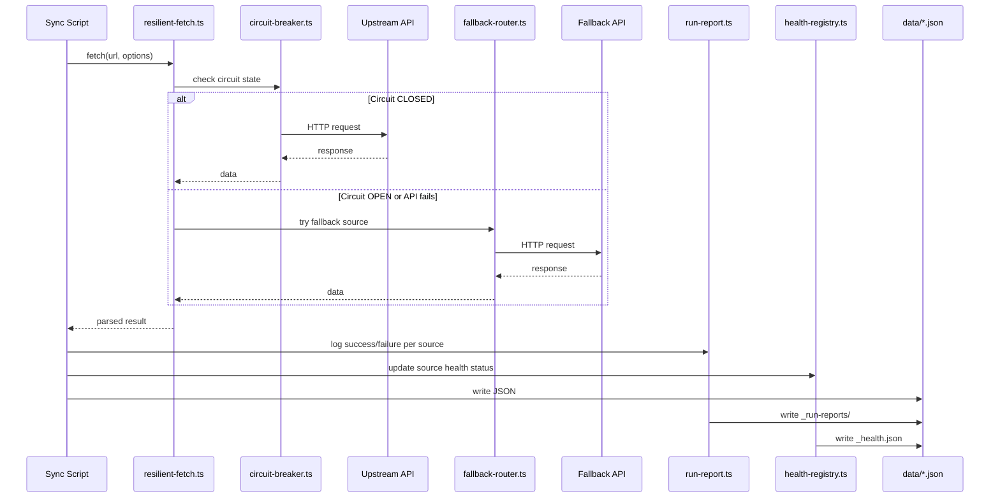

# 🏠 Housing Crisis Tracker . Canada-first, multi-region


A live map of housing policy across 5 regions. Canada is the primary
dataset: 2,065 housing projects, 415 bills, 12 officials, census
division drill-downs, and a legislative funnel. The US is the full
secondary region. Europe and Asia-Pacific carry light coverage updated
via manual dispatch.

> **Live demo:** *coming soon*

---

## ⚡ Quick Start

```bash
git clone https://github.com/Andy00L/housing-crisis-tracker.git && cd housing-crisis-tracker
npm install
cp .env.example .env.local     # fill in your keys (see Configuration)
npm run dev                    # http://localhost:3000
```

No keys are required for local development. The app ships with
pre-built data in `lib/placeholder-data.ts`. Keys are only needed to
run the sync scripts that refresh data from upstream APIs.

---

## 📊 What It Tracks

| Region | Bills | Projects | Officials | Sources |
|--------|------:|:--------:|:---------:|---------|
| 🇨🇦 **Canada (primary)** | 152 federal + 263 provincial | 2,065 | 12 | LEGISinfo, BC Laws, HICC, StatsCan, Tavily |
| 🇺🇸 **United States** | 54 federal + 68 across 10 states | 25 | 9 | Congress.gov API, Tavily, Apify, HUD |
| 🇬🇧 **UK** | 267 | . | 0 | UK Parliament Bills API |
| 🇪🇺 **Europe** (11 entities) | 17 | 19 | 12 | europe-housing.ts, manual dispatch |
| 🌏 **Asia-Pacific** (7 entities) | 15 | 6 | 7 | asia-pacific-housing.ts, manual dispatch |

**Canadian stance breakdown (415 bills):**
76% under review, 13% favorable, 8% concerning, 3% restrictive.

Counts come from `node` over JSON files in `data/`, not from memory. Last verified April 2026.

### 🇨🇦 Canada deep dive

Federal Parliament + all 13 provinces and territories. The 2,065
housing projects come from the NHS (National Housing Strategy)
individual project dataset published by Housing Infrastructure Canada
(HICC). That's 1,608 operational, 444 under construction, 13 proposed.
All projects carry blurbs from the enrichment pipeline.

Census division drill-down is available for QC, ON, AB, and NB. When
you click into a province, the map zooms to census division boundaries
with compact dot clusters sized by project count. Each dot is
color-coded by project type.

The legislative funnel on the home page shows how bills flow through
stages with a per-capita comparison across provinces.

### 🇺🇸 United States

Federal housing legislation plus the top 10 housing-critical states:
California, New York, Texas, Florida, Washington, Massachusetts,
Oregon, Colorado, Arizona, North Carolina. Federal bills come from the
Congress.gov API. State bills come from Tavily queries, Apify state
scrapers, and state legislature domain searches. The other 40 states
render grey on the map. We are honest about coverage rather than
faking it.

### 🇪🇺🌏 Europe + Asia-Pacific

Light coverage. Europe covers UK, Germany, France, Italy, Spain,
Poland, Netherlands, Sweden, Finland, Ireland, and the European
Parliament. Asia-Pacific covers Japan, South Korea, China, India,
Indonesia, Taiwan, Australia. These regions refresh via manual
`europe-asia-sync` dispatch. Countries with 0 bills show a "coverage
is limited in this release" notice.

---

## 🏗️ Architecture

```mermaid
graph TD
    subgraph Primary_Pipelines["🇨🇦 Canadian Pipelines"]
        LEGI[LEGISinfo JSON] --> LEGSYNC[canada-legislation.ts]
        OP[OpenParliament fallback] --> LEGSYNC
        BCLAWS[BC Laws API] --> BCSYNC[bc-legislation.ts]
        CANLII[CanLII via Tavily fallback] --> BCSYNC
        TAV1[Tavily research] --> PROVSYNC[province-housing-research.ts]
        BCH[Build Canada Homes via Tavily] --> PROJSYNC[housing-projects.ts]
        HICC[HICC CSV export] --> NHSSYNC[cmhc-nhs-projects.ts]
        STATCSV[StatsCan CSV download] --> CMHCSYNC[cmhc-projects.ts]
        CANADACA[canada.ca cabinet] --> OFFSYNC[officials.ts]
        TAV2[Tavily enrichment] --> OFFSYNC
        RSS[Canadian housing RSS feeds] --> NEWS[news-rss.ts]
        STATCAN[StatsCan WDS] --> METR[metrics-sync.ts]
        CMHC[CMHC HMI portal] --> METR
        CENSDATA[Census division boundaries] --> MUNSYNC[canada-municipal-housing.ts]
    end

    subgraph Enrichment["🔍 Enrichment Pipeline"]
        TAVILY_E[Tavily search + extract] --> ENRICH[enrich-project-descriptions.ts]
        HAIKU[Claude Haiku summarization] --> ENRICH
    end

    LEGSYNC --> FEDJSON[data/legislation/federal-ca.json]
    BCSYNC --> BCJSON[data/legislation/provinces/BC.json]
    PROVSYNC --> PROVJSON[data/legislation/provinces/*.json]
    PROJSYNC --> PROJJSON[data/projects/canada.json]
    NHSSYNC --> PROJJSON
    CMHCSYNC --> PROJJSON
    MUNSYNC --> MUNJSON[data/municipal/canada/*.json]
    OFFSYNC --> POLSJSON[data/politicians/canada.json]
    NEWS --> NEWSJSON[data/news/summaries.json]
    METR --> METRJSON[data/housing/canada/*.json]
    ENRICH --> PROJJSON

    subgraph Resilience["🛡️ Resilience Layer"]
        RF[resilient-fetch.ts]
        FR[fallback-router.ts]
        RR[run-report.ts]
        HR[health-registry.ts]
    end

    LEGSYNC --> RF
    BCSYNC --> RF
    PROVSYNC --> RF
    PROJSYNC --> RF
    OFFSYNC --> RF
    RF --> RR
    RF --> HR
    RR --> RUNLOG[data/raw/_run-reports/]
    HR --> HEALTHJSON[data/raw/_health.json]

    subgraph Build["📦 Build"]
        BLD[build-placeholder.ts] --> PLH[lib/placeholder-data.ts]
    end

    FEDJSON --> BLD
    BCJSON --> BLD
    PROVJSON --> BLD
    PROJJSON --> BLD
    POLSJSON --> BLD
    NEWSJSON --> BLD
    METRJSON --> BLD

    subgraph UI["🖥️ Next.js 16 App"]
        HEALTH["api/health"]
        FOOTER["HealthFooter"]
        DS["about/data-sources"]
        FUNNEL["LegislativeFunnel"]
        CENSUS["CensusDivisionMap"]
        DIM["DimensionToggle"]
    end

    HEALTHJSON --> HEALTH
    HEALTH --> FOOTER
    FOOTER --> DS

    subgraph Cron["⏰ GitHub Actions"]
        W1[news-rss.yml 3x daily]
        W2[legislation-sync.yml weekly Wed]
        W3[metrics-sync.yml weekly Mon]
        W4[projects-sync.yml weekly Tue]
        W5[officials-sync.yml monthly 1st Sun]
        W6[europe-asia-sync.yml manual dispatch only]
    end

    subgraph US_Pipelines["🇺🇸 US Pipelines"]
        CGOV[Congress.gov API primary] --> USFEDSYNC[us-federal-housing.ts]
        TAVILYF[Tavily enrichment cap] --> USFEDSYNC
        USST[state legislature domains via Tavily] --> USSTSYNC[us-states-housing-research.ts]
        APIFY[Apify state scrapers] --> USSTSYNC
        LEGISCAN[LegiScan dormant supplement] --> USLSSYNC[us-legiscan-housing.ts]
        USPROJ[HUD + state agencies via Tavily] --> USPROJSYNC[us-housing-projects.ts]
        HUDGOV[hud.gov leadership] --> USOFFSYNC[us-officials.ts]
    end

    USFEDSYNC --> USFEDJSON[data/legislation/federal-us-housing.json]
    USSTSYNC --> USSTJSON[data/legislation/us-states-housing/*.json]
    USLSSYNC --> USSTJSON
    USPROJSYNC --> USPROJJSON[data/projects/us.json]
    USOFFSYNC --> USOFFJSON[data/politicians/us.json]

    USFEDJSON --> BLD
    USSTJSON --> BLD
    USPROJJSON --> BLD
    USOFFJSON --> BLD

    subgraph IntlPipelines["🌐 Europe + Asia-Pacific (manual dispatch)"]
        EUSYNC[europe-housing.ts . 11 countries]
        EUOFF[europe-officials.ts]
        APSYNC[asia-pacific-housing.ts . 7 countries]
        APOFF[asia-officials.ts]
    end
    EUSYNC --> W6
    EUOFF --> W6
    APSYNC --> W6
    APOFF --> W6
```



All six workflows finish with a `summarize-run-report` step that
writes a Markdown table to `$GITHUB_STEP_SUMMARY` so you can see the
pipeline status at a glance without digging through logs.

### Data pipeline flow

What happens when a sync script runs, whether triggered by
GitHub Actions or invoked manually.



---

## 🛠️ Technology Stack

| Dependency | Version | Role |
|------------|---------|------|
| Next.js | 16.2.3 | App router, SSR, API routes |
| React | 19.2.4 | UI |
| TypeScript | ^5 | Type safety across all source and scripts |
| Tailwind CSS | ^4 | Styling (PostCSS plugin) |
| maplibre-gl | ^5.23.0 | Vector tile maps for census division views |
| react-simple-maps | ^3.0.0 | SVG choropleth maps (provinces, states, intl) |
| cobe | ^2.0.1 | 3D globe on the globe page |
| framer-motion | ^12.38.0 | Page transitions and scroll animations |
| opossum | ^9.0.0 | Circuit breaker (resilience layer) |
| cheerio | ^1.2.0 | HTML parsing for scraper pipelines |
| adm-zip | ^0.5.17 | ZIP extraction for HICC CSV exports |
| @tavily/core | ^0.7.2 | Tavily search and extract API client |
| @anthropic-ai/sdk | ^0.88.0 | Claude API for classification, blurbs, enrichment |
| @vercel/analytics | ^2.0.1 | Page view analytics |
| @vercel/kv | ^3.0.0 | Visitor counter (Redis-backed KV) |

---

## 📁 Project Structure

```
app/                     Next.js 16 app router pages and API routes
  about/                 About page and data-sources sub-page
  api/health/            Health check endpoint
  bills/                 Legislation browser
  contact/               Contact form
  globe/                 3D globe view
  legislation/[id]/      Individual bill detail
  methodology/           Classification methodology
  news/                  News feed and article detail
  politicians/           Officials grid
  projects/              Project list and detail

components/
  hero/                  GlobeHero, Hero
  map/                   CanadaProvincesMap, USStatesMap, EuropeMap, AsiaMap,
                         NorthAmericaMap, CensusDivisionMap, CountyMap, MapShell,
                         ProjectDots, ProjectCard, MobileLegend
  panel/                 SidePanel, LegislationList, BillExpanded, ContextBlurb,
                         KeyFigures, NewsSection, ProjectsList, ProjectDetail,
                         HousingMetricsSection
  sections/              SummaryBar, LegislationTable, LiveNews, AIOverview,
                         PoliticiansOverview, ProjectsOverview, NuanceLegend,
                         DimensionToggle, LegislativeFunnel, ProjectCard
  ui/                    Header, HealthFooter, TopToolbar, SearchPill, Card,
                         StanceBadge, StagePill, BillTimeline, Breadcrumb,
                         VisitorsWidget, and others

lib/
  resilience/            circuit-breaker, fallback-router, health-registry,
                         rate-limit, run-report
  schemas/               housing-project schema
  sources/               apify, congress-gov, legiscan, openparliament
  placeholder-data.ts    Generated file that feeds the UI at build time
  resilient-fetch.ts     Fetch wrapper with retry + circuit breaker
  tavily-*.ts            Tavily client, cache, budget, types
  search.ts              Client-side search across bills/projects/politicians

scripts/
  build-placeholder.ts   Reads all JSON data and writes placeholder-data.ts
  ci/                    summarize-run-report (GitHub Actions step summary)
  cleanup/               fill-impact-tags, refresh-blurbs, rewrite-blurbs
  geo/                   fetch-canada-geo (census boundary GeoJSON)
  smoke/                 anthropic-ping, legiscan-ping, au-lookup, donor-lookup
  sync/                  41 pipeline scripts (see "Running pipelines manually")

data/
  legislation/           federal-ca.json, federal-us-housing.json,
                         provinces/*.json (13), us-states-housing/*.json (10),
                         europe/, asia-pacific/, uk/
  projects/              canada.json (2,065), us.json, europe/, asia-pacific/
  politicians/           canada.json, us.json, europe.json, uk.json,
                         asia-pacific.json, eu.json, global-leaders.json
  news/                  summaries.json, feeds.json, regional-overviews.json
  international/         Per-country JSON (12 countries)
  municipal/             US municipal housing data (30 states),
                         canada/ census division data
  housing/               Canadian housing metrics (StatCan, CMHC)
  crosswalk/             Bioguide-to-FEC legislator crosswalk
  donors/                Campaign finance data
  figures/               Federal US key figures
  votes/                 Canadian federal vote records
  meta/                  last-sync.json, legiscan-query-count.json
  raw/                   _health.json, _run-reports/

.github/workflows/       6 workflow files (see Architecture diagram)
docs/                    canada-pivot-decisions.md, repurpose-plan.md,
                         us-data-sources.md
```

---

## ⚙️ Configuration

| Variable | Required | Used by |
|----------|:--------:|---------|
| `ANTHROPIC_API_KEY` | yes | Classification, blurbs, news, officials, enrichment |
| `TAVILY_API_KEY` | yes | Provincial research, housing projects, officials, URL validation, enrichment |
| `FRED_API_KEY` | no | US FRED metrics. Weekly metrics-sync only. |
| `CONGRESS_GOV_API_KEY` | no | Primary source for US federal bills. Free, 5000 req/hour. Register at api.congress.gov. |
| `APIFY_API_TOKEN` | no | State legislature scrapers (Colorado, Arizona). Free tier $5/month of compute. |
| `LEGISCAN_API_KEY` | no | US state bills. Dormant until set. When present, upgrades existing state data on next sync. |
| `KV_REST_API_URL` | no | Visitor counter (Vercel KV) |
| `KV_REST_API_TOKEN` | no | Visitor counter (Vercel KV) |

See `.env.example` for the full list with inline notes.

---

## 🚀 Running Locally

```bash
npm install
cp .env.example .env.local
# edit .env.local with your keys
npm run dev
```

The dev server hot-reloads. Type checks run on every file save. Watch
the console for the bioguide-mismatch warnings. They come from the US
politicians dataset and are benign.

---

## 🔄 Running Pipelines Manually

### 🇨🇦 Canada (primary)

```bash
npx tsx scripts/sync/canada-legislation.ts         # Federal bills from LEGISinfo
npx tsx scripts/sync/bc-legislation.ts             # BC provincial bills
npx tsx scripts/sync/province-housing-research.ts  # All other provinces via Tavily
npx tsx scripts/sync/housing-projects.ts           # Housing projects (Build Canada Homes)
npx tsx scripts/sync/cmhc-projects.ts              # StatsCan housing starts data
npx tsx scripts/sync/cmhc-nhs-projects.ts          # NHS individual projects from HICC
npx tsx scripts/sync/canada-municipal-housing.ts   # Census division municipal data
npx tsx scripts/sync/officials.ts                  # Canadian housing officials
npx tsx scripts/sync/statcan-housing.ts            # StatsCan housing metrics
npx tsx scripts/sync/cmhc-housing.ts               # CMHC HMI portal metrics
npx tsx scripts/sync/news-rss.ts                   # RSS news feeds
npm run enrich:projects                            # Project description enrichment (Tavily + Haiku)
```

### 🇺🇸 United States

```bash
npx tsx scripts/sync/us-federal-housing.ts         # Congress.gov API
npx tsx scripts/sync/us-states-housing-research.ts # 10 state legislatures
npx tsx scripts/sync/us-legiscan-housing.ts        # LegiScan supplement (needs key)
npx tsx scripts/sync/us-housing-projects.ts        # HUD + state agencies
npx tsx scripts/sync/us-officials.ts               # Federal housing officials
npx tsx scripts/sync/fred-housing.ts               # FRED economic metrics
npx tsx scripts/sync/census-housing.ts             # Census Bureau housing data
npx tsx scripts/sync/zillow-housing.ts             # Zillow home values
```

### 🇪🇺🌏 Europe and Asia-Pacific (require env guards)

```bash
EXECUTE_EUROPE=1 npx tsx scripts/sync/europe-housing.ts
EXECUTE_EUROPE=1 npx tsx scripts/sync/europe-officials.ts
EXECUTE_ASIA=1 npx tsx scripts/sync/asia-pacific-housing.ts
EXECUTE_ASIA=1 npx tsx scripts/sync/asia-officials.ts
npx tsx scripts/sync/uk-bills.ts
```

### 🌍 International metrics

```bash
npx tsx scripts/sync/eurostat-housing.ts
npx tsx scripts/sync/oecd-housing.ts
npx tsx scripts/sync/worldbank-housing.ts
npx tsx scripts/sync/abs-housing.ts
npx tsx scripts/sync/uk-landregistry.ts
npx tsx scripts/sync/hk-rvd.ts
npx tsx scripts/sync/sg-hdb.ts
```

### After any sync, rebuild the placeholder data:

```bash
npm run data:rebuild
```

Pipelines are idempotent. A second run in the same hour mostly
hits Tavily cache and returns fast.

---

## 📜 npm Scripts

```bash
npm run dev                # Start dev server
npm run build              # Production build (prebuild copies news JSON)
npm run start              # Serve production build
npm run lint               # ESLint
npm run data:rebuild       # Regenerate lib/placeholder-data.ts
npm run news:poll          # Manual RSS poll
npm run news:regen         # Full news summary rebuild
npm run geo:canada         # Fetch Canadian census geography
npm run sync:provinces     # Provincial housing research
npm run sync:cmhc-projects # StatsCan housing starts data
npm run sync:nhs-projects  # NHS individual projects from HICC
npm run sync:canada-municipal # Census division municipal data
npm run enrich:projects    # Project description enrichment (Tavily + Haiku)
npm run blurbs:refresh     # Force-regenerate all province/state blurbs
```

---

## 🗺️ Pages

| Route | What it shows |
|-------|---------------|
| `/` | Home. Summary bar, interactive map, legislative funnel with per-capita comparison, crisis dimension toggle, live news |
| `/bills` | Searchable table of all tracked bills with stance badges |
| `/projects` | Housing project cards with "show completed" toggle. Click through to `/projects/[id]` |
| `/projects/[id]` | Individual project detail |
| `/politicians` | Officials grid with stance badges and filters |
| `/news` | News feed with AI summaries. Click through to `/news/[id]` |
| `/news/[id]` | Individual article with AI generated summary |
| `/legislation/[id]` | Single bill detail with timeline and classification |
| `/globe` | 3D globe view (cobe) showing tracked countries |
| `/about` | About page and data source documentation |
| `/about/data-sources` | Detailed data source explanations per region |
| `/methodology` | How bills get classified, scored, and tagged |
| `/contact` | Contact form |
| `/api/health` | JSON health check. Powers the HealthFooter component |

---

## ⚠️ Tradeoffs and Limitations

- Smaller territories (YT, NT, NU, PE) have very few housing bills.
  That reflects reality, not a data gap. The legislative volume in
  Nunavut is genuinely small.
- Housing project coordinates fall back to province centroids when a
  specific city is not in our lookup table. Dots for those projects
  cluster at the centroid rather than the actual location. The
  fallback chain and resolved precision are exposed by
  `resolveProjectCoordinates` in `lib/projects-map.ts`.
- Census division drill-down only covers QC, ON, AB, NB so far. Other
  provinces fall back to the province-level map.
- All 2,065 projects have type "unknown" in the raw data. The compact
  dot color coding uses a fallback palette until project types are
  classified upstream.
- US coverage is intentionally focused. Top 10 states are tracked in
  depth. The other 40 render grey on the map. When a state legislature
  has a sparse housing-bill slate for a given session, the pipeline may
  pull fewer than 5 bills and mark the URLs as unvalidated if Tavily
  Extract briefly fails.
- Europe and Asia-Pacific entities have light bill/project data per
  country by design. Refreshing those regions requires dispatching the
  `europe-asia-sync` workflow with `execute_europe=1` and/or
  `execute_asia=1`.
- Tavily is on the dev tier (1,000 credits per month). Running the full
  provincial research pipeline plus projects plus officials consumes
  roughly 100 to 150 credits. Heavy manual re-runs will exhaust the
  budget. Pipelines cache aggressively.
- CMHC uses an undocumented export endpoint. The metrics-sync workflow
  has `continue-on-error: true` on the CMHC step, so a broken CMHC day
  does not fail the overall run. Last good values stay in place.
- Data is for informational purposes only. Not legal or financial
  advice.

---

## 📖 Documentation

- [docs/canada-pivot-decisions.md](docs/canada-pivot-decisions.md) . Why the project pivoted to housing policy tracking and the decisions behind a Canada-first approach.
- [docs/repurpose-plan.md](docs/repurpose-plan.md) . The full migration plan from the original codebase, what got kept, what got dropped.
- [docs/us-data-sources.md](docs/us-data-sources.md) . Source hierarchy for US federal and state housing bills (Congress.gov, LegiScan, Apify, Tavily).
- [data/municipal/README.md](data/municipal/README.md) . Explains what the municipal dataset covers and its limitations.

---

## 🤝 Contributing

Fork, branch, PR. Checks before opening the PR:

```bash
npx tsc --noEmit
npm run lint
npm run build
```

The `/docs` folder has the architectural decisions (Canada pivot,
repurpose plan). Read those before making sweeping changes.

---

## 🙏 Attribution

UI framework inspired by [trackpolicy.org](https://trackpolicy.org) by [@isareksopuro](https://x.com/isareksopuro). Open source.

---

## 📄 License

No LICENSE file has been added to the repo yet. The Open Government
Licence . Canada applies to the Canadian legislation and market data
where it is republished from official sources.
