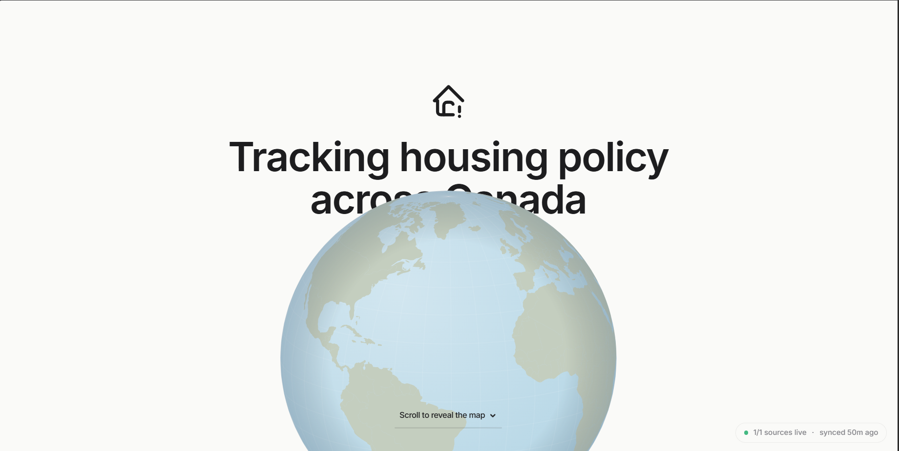
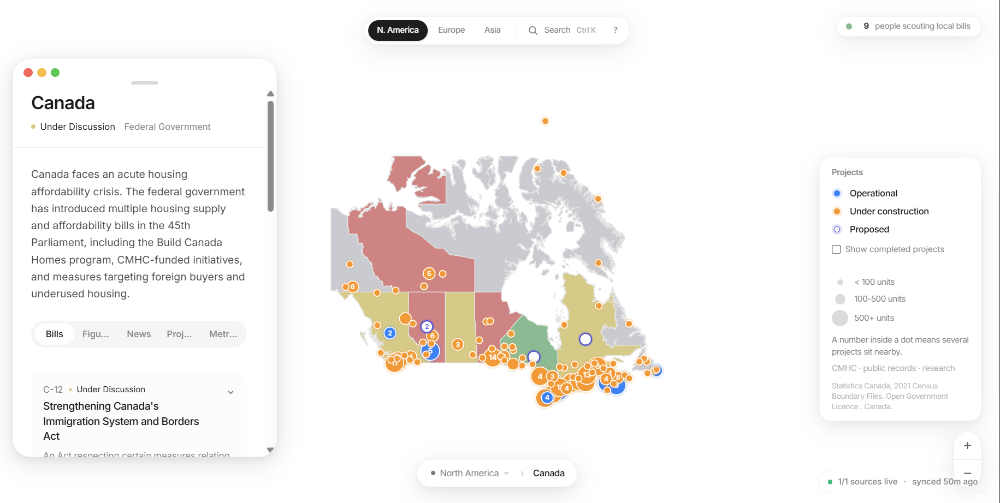
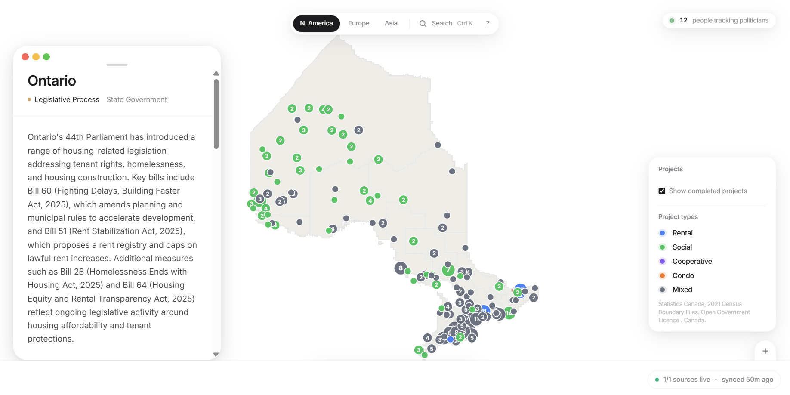

# 🏠 Housing Crisis Tracker: Policy Meets the Map


## 📝 Description

Housing Crisis Tracker is a data-driven policy tracker that maps housing legislation, projects, and officials across 5 regions from a single interface. Canada is the primary dataset with 415 bills, 2,065 NHS housing projects, and 12 officials. The US is the full secondary region with Congress.gov API integration for federal bills and coverage of 10 state legislatures. Europe and Asia-Pacific carry light coverage refreshed via manual dispatch. Every bill gets classified by stance (favorable, restrictive, concerning, review) through a two-stage pipeline: regex heuristics first, then optional Claude reclassification. The app ships pre-built data so no API keys are needed for local development. Built with Next.js 16 App Router, MapLibre GL for census division drill-downs, react-simple-maps for choropleth views, and a resilience layer (circuit breakers, fallback routing, health registry) that keeps pipelines running even when upstream APIs go down.

## 🌐 Live Demo

**Production URL:** [housing-crisis-tracker.vercel.app](https://housing-crisis-tracker.vercel.app/)

**Demo Video:** [Watch on X](https://x.com/Alcyone_x/status/2045356842293854353?s=20)





## ⚡ Quick Start

```bash
git clone https://github.com/Andy00L/housing-crisis-tracker.git && cd housing-crisis-tracker
npm install
cp .env.example .env.local     # fill in your keys (see Configuration)
npm run dev                    # http://localhost:3000
```

No keys are required for local development. The app ships with pre-built data in `lib/placeholder-data.ts`.

## 📊 What It Tracks

| Region | Bills | Projects | Officials |
|--------|------:|:--------:|:---------:|
| Canada (primary) | 415 | 2,065 | 12 |
| United States | 122 | 25 | 9 |
| UK | 267 | . | . |
| Europe (11 entities) | 17 | 19 | 12 |
| Asia-Pacific (7 entities) | 15 | 6 | 7 |

Canada covers Federal Parliament plus all 13 provinces and territories. The 2,065 housing projects come from the NHS individual project dataset (HICC): 1,608 operational, 444 under construction, 13 proposed. Bills are classified by stance: 76% under review, 13% favorable, 8% concerning, 3% restrictive.

The US covers federal legislation via Congress.gov API plus the top 10 housing-critical states (CA, NY, TX, FL, WA, MA, OR, CO, AZ, NC). The other 40 render grey.

Europe and Asia-Pacific carry light coverage refreshed via manual dispatch. Countries with 0 bills show a limited-coverage notice.

Counts come from `node` over JSON files in `data/`, not from memory. Last verified April 2026.

## ✨ Features

- Interactive choropleth maps per region with MapLibre GL for census division drill-down
- Census division zoom for QC, ON, AB, NB with dot clusters by project count and type
- Legislative funnel showing bill flow through stages with per-capita comparison
- Crisis severity dimension toggle (affordability, homelessness, supply)
- Stance badges on every bill: favorable, restrictive, concerning, review
- Two-stage classification: regex heuristics first, optional Claude reclassification second
- Project enrichment pipeline (Tavily + Claude Haiku) for factual blurbs
- 3D globe view (cobe) showing tracked countries
- AI-generated news summaries from RSS feeds
- Health footer showing real-time data source freshness

## ⚙️ Configuration

| Variable | Required | Used by |
|----------|:--------:|---------|
| `ANTHROPIC_API_KEY` | yes | Classification, blurbs, news, officials, enrichment |
| `TAVILY_API_KEY` | yes | Provincial research, housing projects, officials, URL validation, enrichment |
| `FRED_API_KEY` | no | US FRED metrics. Weekly metrics-sync only. |
| `CONGRESS_GOV_API_KEY` | no | Primary source for US federal bills. Free, 5,000 req/hour. |
| `APIFY_API_TOKEN` | no | State legislature scrapers (Colorado, Arizona). |
| `LEGISCAN_API_KEY` | no | US state bills. Dormant until set. |
| `KV_REST_API_URL` | no | Visitor counter (Vercel KV) |
| `KV_REST_API_TOKEN` | no | Visitor counter (Vercel KV) |

See `.env.example` for the full list with inline notes.

## 📜 npm Scripts

```bash
npm run dev                # Start dev server
npm run build              # Production build
npm run start              # Serve production build
npm run lint               # ESLint
npm run data:rebuild       # Regenerate lib/placeholder-data.ts
npm run news:poll          # Manual RSS poll
npm run news:regen         # Full news summary rebuild
npm run geo:canada         # Fetch Canadian census geography
npm run enrich:projects    # Project description enrichment (Tavily + Haiku)
npm run blurbs:refresh     # Force-regenerate all province/state blurbs
```

## 🗺️ Pages

| Route | What it shows |
|-------|---------------|
| `/` | Home. Summary bar, interactive map, legislative funnel, dimension toggle, live news |
| `/bills` | Searchable table of all tracked bills with stance badges |
| `/projects` | Housing project cards. Click through to `/projects/[id]` |
| `/politicians` | Officials grid with stance badges and filters |
| `/news` | News feed with AI summaries. Click through to `/news/[id]` |
| `/legislation/[id]` | Single bill detail with timeline and classification |
| `/globe` | 3D globe view showing tracked countries |
| `/about` | About page and data source documentation |
| `/methodology` | How bills get classified, scored, and tagged |
| `/contact` | Contact form |
| `/api/health` | JSON health check. Powers the HealthFooter component |

## 📖 Documentation

- [ARCHITECTURE.md](ARCHITECTURE.md) . System design, data flow, resilience layer, classification pipeline
- [docs/running-pipelines.md](docs/running-pipelines.md) . Pipeline commands and sync workflow
- [docs/us-data-sources.md](docs/us-data-sources.md) . US federal and state data source hierarchy

## ⚠️ Tradeoffs and Limitations

- Smaller territories (YT, NT, NU, PE) have very few housing bills. That reflects reality, not a data gap.
- Housing project coordinates fall back to province centroids when a city is not in the lookup table. The fallback chain is exposed by `resolveProjectCoordinates` in `lib/projects-map.ts`.
- Census division drill-down only covers QC, ON, AB, NB. Other provinces fall back to the province-level map.
- US coverage is intentionally focused. Top 10 states tracked in depth. The other 40 render grey.
- Europe and Asia-Pacific have light bill/project data per country by design. Refreshing requires dispatching `europe-asia-sync` with the appropriate guards.
- Tavily is on the dev tier (1,000 credits/month). Full provincial research plus projects plus officials consumes roughly 100 to 150 credits. Pipelines cache aggressively.
- CMHC uses an undocumented export endpoint. The metrics-sync workflow has `continue-on-error: true` on the CMHC step.
- Data is for informational purposes only. Not legal or financial advice.

## Testing with TestSprite

This project uses TestSprite MCP for automated AI-driven end-to-end testing. TestSprite generates Playwright-based test cases from the codebase, executes them against the running application, and produces visual test recordings for every run.

### Test Results Summary

| Metric | Value |
|--------|-------|
| Total frontend tests | 15 |
| Round 1 pass rate | 60% (9/15) |
| Round 2 pass rate | 73% (11/15) |
| Coverage areas | Home page map interactions, bills browsing, project explorer, politicians directory, news feed, health footer, side panel navigation |
| Test framework | Playwright (Python, headless Chromium) |

### Bugs Found and Fixed

TestSprite identified two UI bugs during Round 1:

**1. Missing country filter on politicians page**

The country filter dropdown was not rendering on the /politicians page. Visitors could see official cards but had no way to filter by country (Canada, US, UK, Europe, Asia-Pacific).

Fix: Restored the country filter dropdown JSX in PoliticianFilters.tsx.

**2. News article cards not visible on /news page**

The news index page loaded but displayed no article cards. Visitors could not browse or click into any news articles.

Fix: Restored the news card container visibility on the news page.

### Test Plan Updates

**TC012** was navigating to /bills/S-229 which returned a 404. Bill detail pages use the route /legislation/[id]. Updated the test description to use the correct route.

### Remaining Failures

Four tests (TC001, TC002, TC003, TC007) fail because the headless browser does not scroll past the scroll-to-reveal globe hero animation. The map and all interactions below it work correctly when visible. This is a test environment limitation confirmed by manual testing.

### Verification

| Test | Round 1 | Round 2 |
|------|---------|---------|
| TC005: Global search from /bills | Failed | Passed |
| TC012: Bill detail via correct route | Failed | Passed |
| TC013: Politicians country filter | Failed | Passed |
| TC014: News article cards visible | Failed | Passed |

### Test Artifacts

Test cases, plan, and reports are in the testsprite_tests/ folder. Each test includes a link to its visual recording on the TestSprite dashboard.

## 🤝 Contributing

Fork, branch, PR. Before opening:

```bash
npx tsc --noEmit
npm run lint
npm run build
```

Read [ARCHITECTURE.md](ARCHITECTURE.md) before making sweeping changes.

## 📄 License

[MIT](LICENSE)
